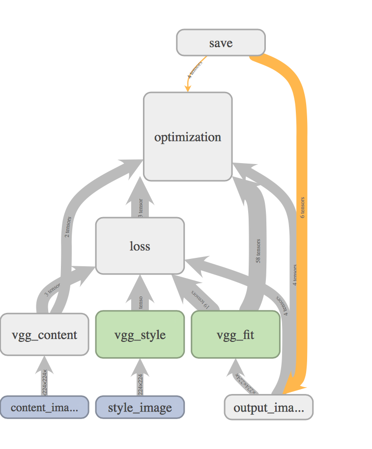

# Neural Artist

## How to Use

1. download `vgg19.pb` over release [page](https://github.com/dboyliao/neural_art/releases/download/0.0.1/vgg19.pb)
2. run `python3 main.py --content-image=your_image.png --style-image=your_style.png -o out_image.png`
3. enjoy!

run `python3 main.py -h` for help

